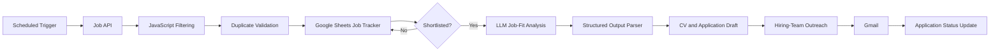

# 🤖 AI Job Application Copilot

> An n8n-based automation suite that discovers relevant data jobs, evaluates job fit, prepares tailored application drafts, supports hiring-team outreach, and keeps the complete process organised in a central tracker.


## 📌 Project Overview

Searching for data roles manually involves repeated work: checking job boards, filtering irrelevant positions, comparing job descriptions with a CV, drafting application material, finding the right contacts, and updating application status.

**AI Job Application Copilot** combines these activities into a modular automation system built with n8n. The project is designed as a practical portfolio project demonstrating workflow automation, API integration, structured data handling, prompt engineering, conditional logic, and business-process improvement.

## 🎯 Objectives

- Collect relevant Data, Analytics, Business Intelligence, AI, and Data Management jobs.
- Remove duplicates and store structured job information.
- Evaluate job fit against a candidate profile.
- Generate tailored CV and application drafts for shortlisted roles.
- Support personalised hiring-team outreach.
- Maintain application status in Google Sheets.
- Create a reusable and auditable job-search workflow.

## ⚙️ Automation Modules

| Module | Purpose | Current status |
|---|---|---|
| **01 — Germany Analytics Job Tracker** | Retrieves job postings, filters relevant data roles, removes duplicates, and updates Google Sheets. | ✅ Working |
| **02 — Tailored CV Draft Generator** | Reads shortlisted roles, evaluates job fit, creates structured application content, and prepares CV drafts. | 🚧 In development |
| **03 — Hiring Team Outreach Agent** | Supports contact discovery, personalised outreach drafting, email delivery, and tracker updates. | 🚧 In development |

## 🧩 System Architecture



## ✨ Key Features

- Scheduled job collection
- API-based job retrieval
- Keyword and location filtering
- Duplicate validation using job URL
- Structured Google Sheets tracking
- LLM-supported job-fit evaluation
- Conditional workflow branching
- Structured output parsing
- CV and application draft generation
- Personalised email workflow
- Modular design for future expansion

## 🛠️ Technology Stack

- **Automation:** n8n
- **Data processing:** JavaScript
- **Data storage and tracking:** Google Sheets
- **Communication:** Gmail
- **Integrations:** REST APIs and Google Cloud credentials
- **AI layer:** Large-language-model nodes with structured output
- **Version control and documentation:** GitHub

## 📁 Repository Structure

```text
ai-job-application-copilot/
├── README.md
├── .gitignore
├── .env.example
├── docs/
│   ├── architecture.md
│   ├── setup-guide.md
│   └── security-checklist.md
├── workflows/
│   ├── 01-germany-analytics-job-tracker/
│   ├── 02-tailored-cv-draft-generator/
│   └── 03-hiring-team-outreach-agent/
├── prompts/
├── sample-data/
└── screenshots/
```

## 🚀 How the System Works

### 1. Discover jobs

The scheduled workflow requests recent vacancies from a job API and extracts the relevant fields.

### 2. Filter vacancies

A JavaScript node keeps roles related to Data, Analytics, Business Intelligence, AI, and Data Management.

### 3. Prevent duplicates

The job URL acts as the matching key before records are added or updated in Google Sheets.

### 4. Evaluate job fit

Shortlisted jobs are processed through an LLM-supported evaluation workflow using structured output.

### 5. Prepare application drafts

The workflow creates tailored content that can be reviewed before being used in an application.

### 6. Support outreach

The outreach module prepares personalised messages, sends approved emails, and updates the tracker.

## 📊 Example Tracker Fields

| Field | Example |
|---|---|
| Job Title | Junior Data Analyst |
| Company | Example GmbH |
| Location | Berlin, Germany |
| Job URL | `https://example.com/job/123` |
| Fit Score | 82 |
| Application Status | CV Drafted |
| Contact Status | Not Started |
| Last Updated | 2026-07-20 |

The repository contains only synthetic sample data. Personal job-search information is excluded.

## 🔧 Installation and Setup

1. Install or open n8n.
2. Create the required Google Sheets and Gmail credentials inside n8n.
3. Copy `.env.example` to a private local `.env` file when environment variables are required.
4. Import each sanitised workflow JSON file from its workflow folder.
5. Update node configuration with your own spreadsheet, credentials, prompts, and filters.
6. Run every workflow manually before activating its schedule.

Detailed instructions are available in [`docs/setup-guide.md`](docs/setup-guide.md).

## 🔐 Security

This public repository must never contain:

- API keys
- OAuth tokens
- Passwords
- Google credential files
- Personal email addresses
- Private CV files
- Real applicant or recruiter data
- Production spreadsheet IDs
- Unredacted n8n credential information

Review [`docs/security-checklist.md`](docs/security-checklist.md) before every upload.

## 🗺️ Roadmap

- [x] Build the Germany Analytics Job Tracker
- [x] Add duplicate validation using job URL
- [x] Connect Google Sheets tracking
- [x] Verify Gmail delivery
- [ ] Complete the Tailored CV Draft Generator
- [ ] Complete the Hiring Team Outreach Agent
- [ ] Add workflow JSON exports after sanitisation
- [ ] Add test cases and error handling
- [ ] Add execution monitoring and failure alerts
- [ ] Add a dashboard for application performance
- [ ] Add human approval before external communication

## 💡 Skills Demonstrated

- Workflow automation
- API integration
- JavaScript data transformation
- Data validation and deduplication
- Google Workspace integration
- Prompt engineering
- Conditional business logic
- Documentation
- Security-aware project publishing
- Process optimisation

## 📷 Screenshots

Add screenshots to the [`screenshots`](screenshots/) folder and replace this section with images such as:

```markdown


```

Before uploading screenshots, blur or remove names, email addresses, tokens, spreadsheet IDs, and other personal information.

## 👤 Author

**Faisal Khan K**  
Master’s graduate in Data Science with experience in data analytics, operational analytics, reporting, and business-process improvement.

- GitHub: https://github.com/faisalkhankrn
- LinkedIn: www.linkedin.com/in/faisalkhank

## ⚠️ Disclaimer

This project is intended for learning, portfolio demonstration, and responsible workflow assistance. Application content and external emails should be reviewed by a person before submission or delivery.
