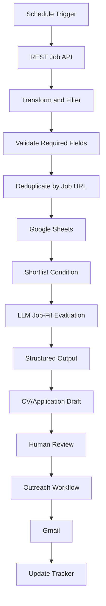

# Architecture

## Overview

The project uses independent n8n workflows connected through a shared Google Sheets job tracker.

## Design Principles

1. **Modular workflows:** Each business responsibility is separated.
2. **Human review:** Application content and external communication should be reviewed.
3. **Idempotency:** Duplicate checking prevents repeated job records.
4. **Auditability:** The tracker records status and processing progress.
5. **Security:** Secrets remain in n8n credentials or private environment variables.
6. **Extensibility:** Additional job sources and scoring logic can be added later.
